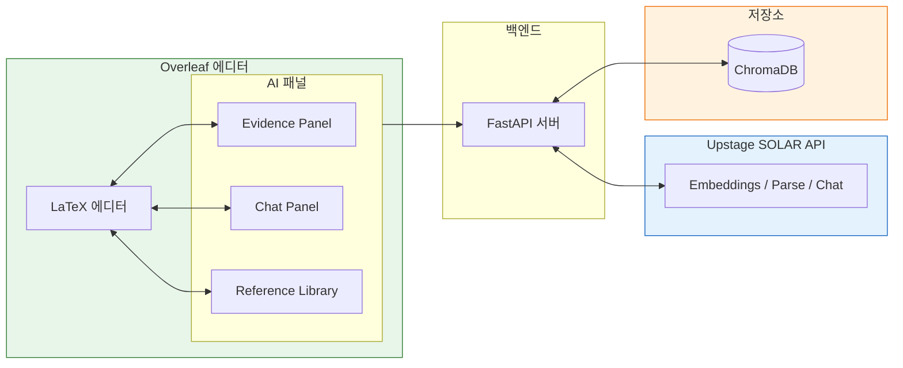
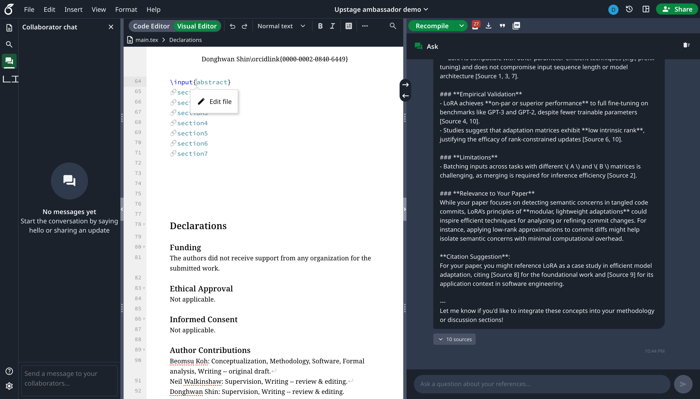
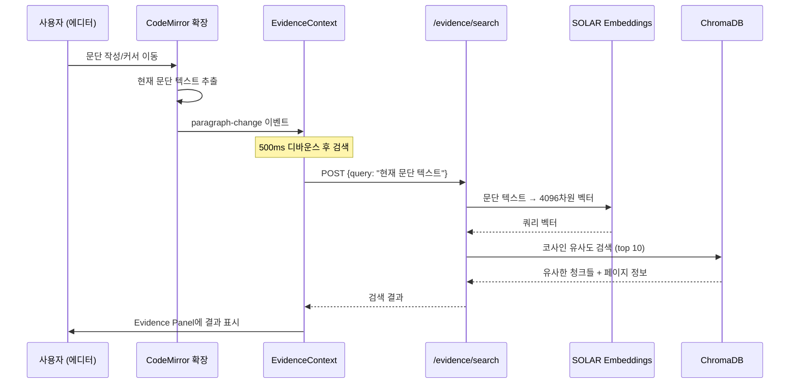
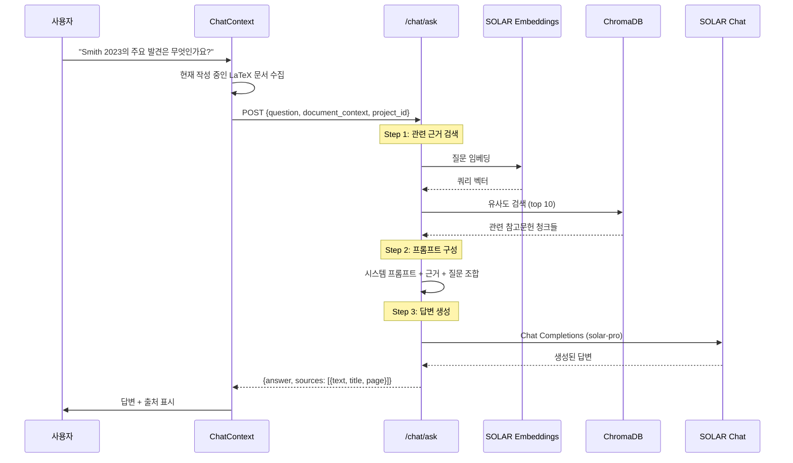
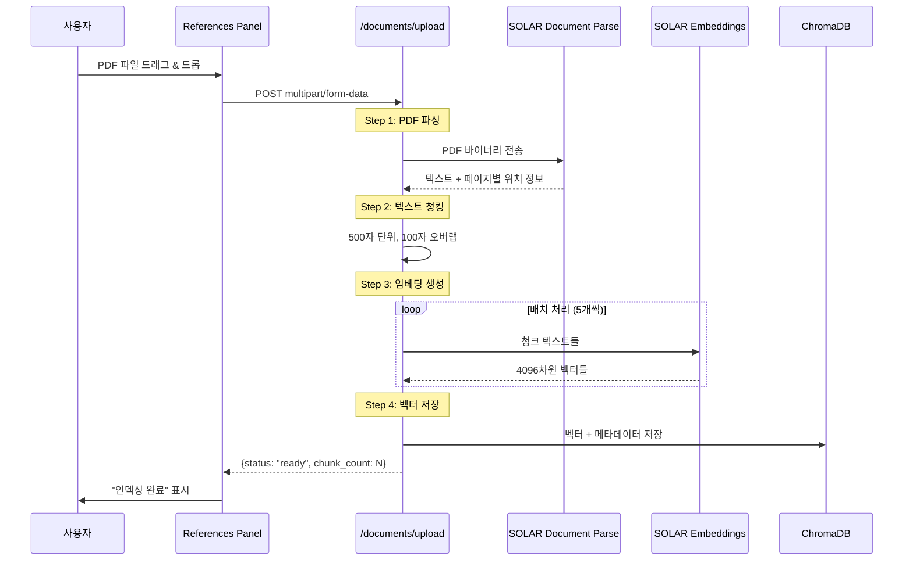

# My Awesome RA

> **참고문헌 기반 LaTeX 논문 작성을 위한 AI 에이전트**
> [Upstage SOLAR API](https://console.upstage.ai/) 기반

**My Awesome RA**는 논문 작성 중 참고문헌 근거를 자동으로 찾고, 질의응답하며, 문서를 관리하는 **AI 논문 작성 어시스턴트**입니다.
[Overleaf Community Edition(CE)](https://github.com/overleaf/overleaf)을 포크하여, 에디터 내부에서 **근거 탐색 → 질의응답 → 문서 관리 → 인용**까지 한 흐름으로 수행할 수 있도록 설계되었습니다.

## 시스템 개요



| 패널 | 트리거 | Upstage API | 결과 |
|------|--------|-------------|------|
| **Evidence Panel** | 문단 작성 | Embeddings → 유사도 검색 | 관련 근거 + 페이지 |
| **Chat Panel** | 질문 입력 | Embeddings + Chat | RAG 답변 + 출처 |
| **Reference Library** | PDF 업로드 | Document Parse | 벡터 인덱싱 |

### Upstage API Endpoints

| API | Endpoint | Model/Config | 용도 |
|-----|----------|--------------|------|
| **Embeddings** | `/v1/solar/embeddings` | `solar-embedding-1-large-query` (쿼리)<br>`solar-embedding-1-large-passage` (문서) | 텍스트 벡터화 (4096차원) |
| **Document Parse** | `/v1/document-ai/document-parse` | Output: `html`, `text` | PDF → 텍스트/HTML 변환 + 페이지 위치 정보 |
| **Chat Completions** | `/v1/solar/chat/completions` | `solar-pro` (temp: 0.7, max_tokens: 2048) | RAG 기반 대화형 답변 생성 |
| **Information Extraction** | `/v1/document-ai/information-extraction` | Schema: `citation` | 참고문헌 메타데이터 추출 |

Base URL: `https://api.upstage.ai`

## 왜 My Awesome RA인가?

논문 작성 과정에서 가장 자주 흐름이 끊기는 지점은 **근거를 찾고 검증하는 순간**입니다.
My Awesome RA는 다음 질문에 즉시 답하는 것을 목표로 합니다.

* *"이 문장을 뒷받침하는 근거가 뭐였지?"*
* *"어디 페이지를 인용한 거지?"*
* *"에디터를 벗어나지 않고 확인할 수 없을까?"*

## 데모

### Evidence Panel


### Chat Panel


### Reference Library


## 기능

| 기능                      | 설명                                | 상태 |
| ------------------------- | --------------------------------- | ------ |
| **Evidence Search**       | 문단 변경 시 자동 검색 (500ms 디바운스) + 수동 검색 지원 | ✅      |
| **Chat Panel**            | 참고문헌 기반 RAG 질의응답                  | ✅      |
| **PDF Upload & Indexing** | PDF → SOLAR 파싱 → ChromaDB 인덱싱     | ✅      |
| **Reference Library**     | PDF 업로드 기반 참고문헌 관리 (cite key 선택적 연결) | ✅      |

## 핵심 기능 흐름

### Evidence Panel

**자동 검색:** 문단 작성 → 500ms 디바운스 후 자동 검색 → 클릭하여 인용
**수동 검색:** 검색창에 직접 쿼리 입력 → 검색 버튼 클릭

"이 주장에 맞는 근거가 뭐였지?"를 **PDF 수동 탐색 없이** 해결합니다.
문단을 쓰는 즉시 **관련 청크 + 페이지 정보**를 패널에서 미리보기로 제공하며, 필요시 직접 검색도 가능합니다.



### Chat Panel

질문 입력 → 관련 근거 검색 → AI 답변 + 출처

"이 참고문헌에서 방법론이 뭐였지?" 같은 질문을 **근거 기반으로 답변**합니다.
답변에 **출처 (청크/페이지)**를 함께 제공하여 검증 가능하게 유지합니다.



### Reference Library

PDF 업로드 → 자동 파싱 → 검색 가능

"새 참고문헌 PDF 추가하면 바로 검색되게 하고 싶다" → 업로드 즉시 인덱싱됩니다.



### Evidence Panel vs Chat Panel

| 구분 | Evidence Panel | Chat Panel |
|------|----------------|------------|
| **트리거** | 문단 이벤트 (자동) / 검색창 (수동) | 사용자 질문 (수동) |
| **목적** | 근거 후보 빠르게 제시 → 인용 삽입 | 근거 기반 요약/설명/비교 |
| **출력** | 근거 리스트 (스니펫 + 페이지) | 답변 + 출처 |

두 패널은 같은 인덱스(참고문헌 PDF → 청킹 → 임베딩 → Vector DB)를 공유합니다.

## 빠른 시작

### 사전 요구사항

* Docker & Docker Compose
* [Upstage API Key](https://console.upstage.ai/)

### 데모 모드 (권장)

단일 명령어로 Overleaf + RA API + 데모 프로젝트를 실행합니다 (사용자 자동 생성).

```bash
git clone --recursive https://github.com/GoBeromsu/my-awesome-ra.git
cd my-awesome-ra

export UPSTAGE_API_KEY=<your_upstage_key>
cd deployment
docker compose --profile demo up -d   # 코드 변경 후에는 --build 추가
# 1-2분 대기; 선택사항: docker compose logs -f demo-init
```

접속: [http://localhost](http://localhost)
로그인: `demo@example.com` / `Demo@2024!Secure`
데모 프로젝트: **"Upstage ambassador demo"** — 저자의 논문 [Detecting Multiple Semantic Concerns in Tangled Code Commits](https://arxiv.org/abs/2601.21298)를 사용합니다 (LaTeX 파일 사전 로드됨; history 서비스 비활성화 시 fixture 이미지 경고는 무시해도 됨).

초기 상태로 리셋 (데이터 볼륨 삭제):

```bash
cd deployment
docker compose down
docker volume rm deployment_overleaf-data deployment_api-data deployment_mongo-data deployment_redis-data
docker compose --profile demo up -d
```

### 개발 모드

```bash
# CLSI 빌드 (최초 1회)
cd overleaf
docker build -f develop/Dockerfile.clsi-dev -t develop-clsi .

# 개발 서비스 시작
cd develop
docker compose up -d mongo redis web webpack clsi filestore docstore document-updater history-v1 real-time

# MongoDB 레플리카셋 초기화
docker exec develop-mongo-1 mongosh --quiet --eval "rs.initiate()"

# 데모 설정
CONTAINER_NAME=develop-web-1 ./scripts/setup-demo.sh
```

## API 엔드포인트

### 핵심

| 메서드   | 엔드포인트          | 설명                      |
| -------- | ------------------ | ------------------------ |
| `POST`   | `/evidence/search` | 쿼리 기반 근거 검색          |
| `POST`   | `/chat/ask`        | RAG 질의응답               |

### 문서 관리

| 메서드   | 엔드포인트                    | 설명                      |
| -------- | ---------------------------- | ------------------------ |
| `GET`    | `/documents`                 | 인덱싱된 문서 목록 조회      |
| `POST`   | `/documents/upload`          | PDF 업로드 및 인덱싱        |
| `GET`    | `/documents/{id}/status`     | 인덱싱 상태 조회            |
| `GET`    | `/documents/{id}/file`       | 원본 PDF 다운로드          |
| `POST`   | `/documents/{id}/reindex`    | 문서 재파싱 및 재인덱싱      |
| `DELETE` | `/documents/{id}`            | 문서 삭제                  |

## 프로젝트 구조

```text
my-awesome-ra/
├── apps/api/              # FastAPI 백엔드
├── overleaf/              # Overleaf CE 포크
├── deployment/            # Docker Compose
├── fixtures/              # 데모 데이터
└── scripts/               # 설정 및 유틸리티
```

## 기술 스택

| 레이어    | 기술                                    |
| -------- | --------------------------------------- |
| AI       | Upstage SOLAR (Embeddings, Parse, Chat) |
| 백엔드    | FastAPI, ChromaDB                       |
| 프론트엔드 | React, TypeScript, CodeMirror 6         |
| 에디터    | Overleaf CE                             |
| 인프라    | Docker Compose                          |

## 환경 설정

### 필수 설정

| 변수              | 필수 | 기본값                              | 설명                      |
| ----------------- | :--: | ---------------------------------- | ------------------------ |
| `UPSTAGE_API_KEY` |  ✅  | -                                  | SOLAR API 키              |


#### 데모 & 개발

| 변수               | 기본값            | 설명                              |
| ------------------ | ---------------- | --------------------------------- |
| `SEED_INDEX_PATH`  | `fixtures/seed`  | 초기 시드 인덱스 경로               |
| `RESET_TO_SEED`    | `false`          | 시작 시 시드 인덱스로 리셋 여부      |
| `FRONTEND_URL`     | -                | CORS를 위한 프론트엔드 URL          |

## 라이선스

AGPL-3.0 (Overleaf CE와 호환)
