# My Awesome RA

> **AI Agent for Reference-Grounded LaTeX Paper Writing**
> Powered by [Upstage SOLAR API](https://console.upstage.ai/)

**My Awesome RA**는 논문 작성 중 *현재 작성 중인 문단*에 맞는 참고문헌 근거를 자동으로 찾아주는 **Evidence Panel 기반 AI Agent**입니다.
Overleaf Community Edition(CE)을 포크하여, 에디터 내부에서 **근거 탐색 → 확인 → 인용**까지 한 흐름으로 수행할 수 있도록 설계되었습니다.

---

## System Overview

```mermaid
flowchart TB
    subgraph User["👤 사용자"]
        Write["✍️ 논문 작성"]
        Ask["❓ 질문하기"]
        Upload["📄 PDF 업로드"]
    end

    subgraph Overleaf["🖥️ Overleaf Editor"]
        Editor["📝 LaTeX Editor"]

        subgraph Panels["AI 패널"]
            Evidence["🔍 Evidence Panel<br/><i>근거 자동 추천</i>"]
            Chat["💬 Chat Panel<br/><i>RAG 질의응답</i>"]
            RefLib["📚 Reference Library<br/><i>참고문헌 관리</i>"]
        end
    end

    subgraph Backend["⚙️ Backend Server"]
        API["🚀 FastAPI"]
    end

    subgraph AI["🤖 Upstage SOLAR API"]
        Embed["🧠 Embeddings<br/><i>의미 벡터 변환</i>"]
        Parse["📖 Document Parse<br/><i>PDF 텍스트 추출</i>"]
        LLM["💡 Chat Completions<br/><i>AI 답변 생성</i>"]
    end

    subgraph Storage["💾 Vector Database"]
        Chroma[("🗄️ ChromaDB<br/><i>근거 청크 저장</i>")]
    end

    %% User interactions
    Write --> Editor
    Ask --> Chat
    Upload --> RefLib

    %% Editor to Panels
    Editor <--> Evidence
    Editor <--> Chat
    Editor <--> RefLib

    %% Panels to Backend
    Evidence --> API
    Chat --> API
    RefLib --> API

    %% Backend to AI Services
    API <--> Embed
    API <--> Parse
    API <--> LLM

    %% Storage connections
    Embed <--> Chroma
    Parse --> Chroma

    %% Styling
    style Overleaf fill:#e8f5e9,stroke:#2e7d32,stroke-width:2px
    style AI fill:#e3f2fd,stroke:#1565c0,stroke-width:2px
    style Storage fill:#fff3e0,stroke:#ef6c00,stroke-width:2px
    style Panels fill:#f3e5f5,stroke:#7b1fa2,stroke-width:2px
```



| 기능 | 사용자 액션 | AI 처리 | 결과 |
|------|------------|---------|------|
| **Evidence Panel** | 문단 작성 | 의미 검색 → 유사 근거 탐색 | 관련 논문 구절 + 페이지 표시 |
| **Chat Panel** | 질문 입력 | RAG (검색 + 생성) | 근거 기반 답변 + 출처 |
| **Reference Library** | PDF 업로드 | 파싱 → 청킹 → 임베딩 | 검색 가능한 벡터 저장 |

---

## Why My Awesome RA?

논문 작성 과정에서 가장 자주 흐름이 끊기는 지점은 **근거를 찾고 검증하는 순간**입니다.
My Awesome RA는 다음 질문에 즉시 답하는 것을 목표로 합니다.

* *“이 문장을 뒷받침하는 근거가 뭐였지?”*
* *“어디 페이지를 인용한 거지?”*
* *“에디터를 벗어나지 않고 확인할 수 없을까?”*

---

## Demo

### Evidence Panel


### Reference Library


---

## Features

| Feature                   | Description                       | Status |
| ------------------------- | --------------------------------- | ------ |
| **Evidence Search**       | 현재 문단 의미 기반 근거 자동 검색 (500ms 디바운스) | ✅      |
| **Chat Panel**            | 참고문헌 기반 RAG 질의응답                  | ✅      |
| **PDF Upload & Indexing** | PDF → SOLAR 파싱 → ChromaDB 인덱싱     | ✅      |
| **Reference Library**     | `.bib` 기반 참고문헌 목록 관리              | ✅      |

---

## How It Works (High-Level)

1. 사용자가 LaTeX 문단을 작성합니다.
2. 에디터가 현재 커서 위치의 문단을 감지합니다.
3. 문단 의미를 기반으로 관련 참고문헌 구간을 검색합니다.
4. Evidence Panel에서 근거를 즉시 확인하고 인용합니다.

> 핵심은 **"검색하지 않아도, 쓰는 순간 근거가 보인다"**는 점입니다.

---

## Architecture

```
┌─────────────────────────────────────────────────────────────┐
│                        Overleaf CE                          │
│  ┌──────────────────┐    ┌────────────────────────────┐    │
│  │   LaTeX Editor   │    │    Evidence Panel Module   │    │
│  │  (CodeMirror 6)  │───▶│  - Evidence 자동 검색      │    │
│  │                  │    │  - Chat (RAG Q&A)          │    │
│  └──────────────────┘    │  - PDF 업로드/인덱싱       │    │
│                          └────────────────────────────┘    │
└─────────────────────────────────────────────────────────────┘
                               │
                               ▼
┌─────────────────────────────────────────────────────────────┐
│                    FastAPI Backend                          │
│  ┌──────────────┐  ┌──────────────┐  ┌──────────────┐      │
│  │ /evidence    │  │ /documents   │  │ /chat        │      │
│  │ /search      │  │ /upload      │  │ /ask         │      │
│  └──────┬───────┘  └──────┬───────┘  └──────┬───────┘      │
│         │                 │                 │               │
│         ▼                 ▼                 ▼               │
│  ┌─────────────────────────────────────────────────────┐   │
│  │                 Upstage SOLAR API                   │   │
│  │  • Embeddings (4096-dim)                             │   │
│  │  • Document Parse                                   │   │
│  │  • Chat Completions (solar-pro)                     │   │
│  └─────────────────────────────────────────────────────┘   │
│         │                                                   │
│         ▼                                                   │
│  ┌──────────────┐                                          │
│  │  ChromaDB    │  (persistent vector store)               │
│  └──────────────┘                                          │
└─────────────────────────────────────────────────────────────┘
```

---

## Core Feature Flows

### Evidence Panel Flow

"이 주장에 맞는 근거가 뭐였지?"를 **PDF 수동 탐색 없이** 해결합니다.
문단을 쓰는 즉시 **관련 청크 + 페이지 정보**를 패널에서 미리보기로 제공합니다.

```mermaid
sequenceDiagram
    participant U as 사용자(Overleaf Editor)
    participant CM as CodeMirror Extension
    participant EC as EvidenceContext(UI State)
    participant API as Backend /evidence/search
    participant EMB as SOLAR Embeddings
    participant VDB as Vector DB(ChromaDB)

    U->>CM: 커서 이동/문단 편집
    CM->>CM: 현재 문단 추출
    CM->>EC: paragraph-change 이벤트 발행
    Note over EC: debounce(500ms) + 동일 문단 캐시 체크

    EC->>API: POST { query: paragraph_text, project_id }
    API->>EMB: query 임베딩 생성
    EMB-->>API: query_vector
    API->>VDB: similarity_search(top_k)
    VDB-->>API: chunks[{text, doc_id, page, score, bib_key}]
    API-->>EC: 결과 반환
    EC-->>U: Evidence Panel에 스니펫/페이지 표시

    U->>EC: 결과 클릭(Preview/Cite)
    EC->>U: PDF 프리뷰 점프 또는 인용 삽입
```



### Chat Panel Flow (RAG Q&A)

"이 참고문헌에서 방법론이 뭐였지?" 같은 질문을 **근거 기반으로 답변**합니다.
답변에 **출처 (청크/페이지)**를 함께 제공하여 검증 가능하게 유지합니다.

```mermaid
sequenceDiagram
    participant U as 사용자(Chat Panel)
    participant CC as ChatContext(UI State)
    participant API as Backend /chat/ask
    participant EMB as SOLAR Embeddings
    participant VDB as Vector DB(ChromaDB)
    participant LLM as SOLAR Chat(Completions)

    U->>CC: 질문 입력/전송
    CC->>CC: (선택) 현재 LaTeX 문서/선택 영역 수집
    CC->>API: POST { question, document_context?, project_id }

    Note over API: Step 1) Retrieval
    API->>EMB: question 임베딩
    EMB-->>API: q_vector
    API->>VDB: similarity_search(top_k)
    VDB-->>API: evidence_chunks[{text, page, title, bib_key}]

    Note over API: Step 2) Prompt Assembly
    API->>API: system + question + document_context + evidence_chunks 구성

    Note over API: Step 3) Generation
    API->>LLM: chat completion 요청
    LLM-->>API: answer

    API-->>CC: { answer, sources:[...] }
    CC-->>U: 답변 + 출처 UI 렌더링
```



### Evidence Panel vs Chat Panel

| 구분 | Evidence Panel | Chat Panel |
|------|----------------|------------|
| **트리거** | 문단 이벤트 (자동) | 사용자 질문 (수동) |
| **목적** | 근거 후보 빠르게 제시 → 인용 삽입 | 근거 기반 요약/설명/비교 |
| **출력** | 근거 리스트 (스니펫 + 페이지) | 답변 + 출처 |

두 패널은 같은 인덱스(참고문헌 PDF → 청킹 → 임베딩 → Vector DB)를 공유합니다.

---

## Quick Start

### Prerequisites

* Docker & Docker Compose
* [Upstage API Key](https://console.upstage.ai/)

---

### Demo Mode (Recommended)

One command brings up Overleaf + RA API + seeded demo project (user created automatically).

```bash
git clone --recursive https://github.com/GoBeromsu/my-awesome-ra.git
cd my-awesome-ra

export UPSTAGE_API_KEY=<your_upstage_key>
cd deployment
docker compose --profile demo up -d   # add --build after code changes
# wait ~1–2 min; optional: docker compose logs -f demo-init
```

Access: [http://localhost](http://localhost)  
Login: `demo@example.com` / `Demo@2024!Secure`  
Demo project: **“Upstage ambassador demo”** (pre-loaded with LaTeX files; fixture images are skipped if history service is disabled—safe to ignore warnings).

Reset to a fresh demo state (wipe data volumes):

```bash
cd deployment
docker compose down
docker volume rm deployment_overleaf-data deployment_api-data deployment_mongo-data deployment_redis-data
docker compose --profile demo up -d
```

---

### Development Mode

```bash
# Build CLSI (first time)
cd overleaf
docker build -f develop/Dockerfile.clsi-dev -t develop-clsi .

# Start dev services
cd develop
docker compose up -d mongo redis web webpack clsi filestore docstore document-updater history-v1 real-time

# Init MongoDB replica set
docker exec develop-mongo-1 mongosh --quiet --eval "rs.initiate()"

# Setup demo
CONTAINER_NAME=develop-web-1 ./scripts/setup-demo.sh
```
---

## API Endpoints

| Method   | Endpoint                 | Description              |
| -------- | ------------------------ | ------------------------ |
| `GET`    | `/health`                | Health check             |
| `POST`   | `/evidence/search`       | Search evidence by query |
| `POST`   | `/chat/ask`              | RAG Q&A                  |
| `POST`   | `/documents/upload`      | Upload & index PDF       |
| `GET`    | `/documents/{id}/status` | Indexing status          |
| `DELETE` | `/documents/{id}`        | Remove document          |

---

## Project Structure

```text
my-awesome-ra/
├── apps/api/              # FastAPI backend
├── overleaf/              # Forked Overleaf CE
│   └── evidence-panel/    # Evidence Panel module
├── deployment/            # Docker Compose
├── fixtures/              # Demo data
└── scripts/               # Setup & utilities
```

---

## Tech Stack

| Layer    | Technology                              |
| -------- | --------------------------------------- |
| AI       | Upstage SOLAR (Embeddings, Parse, Chat) |
| Backend  | FastAPI, ChromaDB                       |
| Frontend | React, TypeScript, CodeMirror 6         |
| Editor   | Overleaf CE                             |
| Infra    | Docker Compose                          |

---

## Configuration

| Variable          | Required | Description    |
| ----------------- | :------: | -------------- |
| `UPSTAGE_API_KEY` |     ✅    | SOLAR API key  |
| `CHUNK_SIZE`      |          | Default: `500` |
| `CHUNK_OVERLAP`   |          | Default: `100` |

---

## License

AGPL-3.0 (compatible with Overleaf CE)
